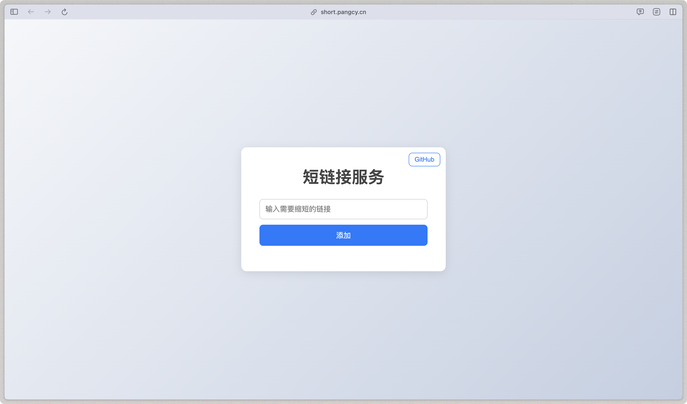

<!--
 * @Author: zi.yang
 * @Date: 2024-12-11 19:24:33
 * @LastEditors: zi.yang
 * @LastEditTime: 2025-06-10 00:11:43
 * @Description: 
 * @FilePath: /short-link/README.md
-->

# 短链接服务

一个基于 Vue、Fastify、Vercel 和 Supabase 构建的 URL 缩短服务。

## 概述

短链接服务允许用户缩短 URL，以便于分享和管理。它利用 Vue 作为前端框架，Fastify 作为后端，Vercel 进行部署，并使用 Supabase 作为数据库解决方案。

- 实现原理：[半个小时，我开发了个短链接服务](https://juejin.cn/post/7511983823259189287)
- 部署教程：[从零搭建一个免费稳定的私有短链接服务](https://juejin.cn/post/7511671401683992587)

## 在线访问

你可以在线访问该服务：[https://short.pangcy.cn](https://short.pangcy.cn)

## 功能

- **快速可靠**：使用 Fastify 构建，性能优越。
- **现代化 UI**：使用 Vue 构建的响应式用户界面。
- **可扩展性**：部署在 Vercel 上，确保可扩展性和可靠性。
- **安全性**：使用 Supabase 进行安全的数据存储。
- **用户友好界面**：简单直观的 UI，便于 URL 缩短。

## 快速开始

### 前提条件

确保你已安装以下软件：

- Node.js
- Vercel CLI

### 安装

克隆仓库并安装依赖：

```bash
git clone https://github.com/Alessandro-Pang/short-link.git
cd short-link
pnpm install
```

### 本地开发

要在本地运行项目，请按照以下步骤操作：

1. 全局安装 Vercel CLI：

   ```bash
   npm install -g vercel@latest
   ```

2. 将你的项目与 Vercel 关联：

   ```bash
   vercel link
   ```

3. 拉取环境变量：

   ```bash
   vercel env pull .env.development.local
   ```

4. 启动开发服务器：

   ```bash
   npm run dev
   ```

## 使用方法

1. 在输入框中输入你希望缩短的 URL。
2. 点击"生成短链接"按钮生成短链接。
3. 复制生成的短链接以便分享。
4. 可以使用分享、生成二维码等功能方便地分享短链接。

## 界面预览



## 贡献

欢迎贡献！请 fork 仓库并提交 pull request 以进行任何改进或错误修复。

## 许可证

本项目采用 MIT 许可证。详情请参阅 [LICENSE](./LICENSE) 文件。
